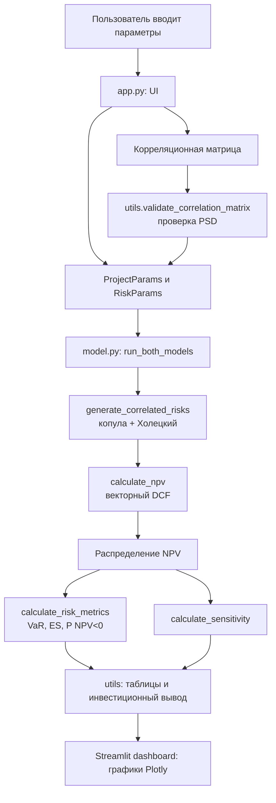

# PROJECT_MAP.md
# Карта проекта

**Проект:** «Монте-Карло оценка девелоперского проекта: NPV и корреляция рисков»
**Автор:** Левшин Даниил Дмитриевич

---

## 1. Структура файлов

```
monte-carlo-developer-dashboard/
├── app.py                  # интерфейс Streamlit и графики (10 разделов)
├── model.py                # расчётное ядро: NPV, Монте-Карло, копула, метрики
├── utils.py                # форматирование, проверка матрицы, таблицы, выводы
├── requirements.txt        # зависимости (streamlit, numpy, pandas, scipy, plotly)
├── README.md               # описание проекта, запуск, деплой, методология
├── .streamlit/
│   └── config.toml         # тема оформления (светлая, корпоративные цвета)
│
├── EXAM_GUIDE_NotebookLM.md  # главный экзаменационный гайд
├── CODE_WALKTHROUGH.md       # построчный разбор кода
├── DEFENSE_SCRIPT.md         # сценарий устной защиты
├── EXAM_QA.md                # вопросы и ответы
└── PROJECT_MAP.md            # этот файл
```

---

## 2. Схема потока данных

```
Пользовательский ввод (sidebar + разделы 3–4 в app.py)
        │
        ▼
ProjectParams  +  RiskParams  +  корреляционная матрица
        │
        ▼
utils.validate_correlation_matrix  ──►  корректная (PSD) матрица
        │
        ▼
model.run_both_models
        │
        ├── generate_correlated_risks (гауссова копула + Холецкий)
        │           │
        │           ▼
        │     значения 5 факторов риска (N×5)
        │           │
        │           ▼
        ├── calculate_npv (векторный DCF)  ──►  массив NPV (N значений)
        │           │
        │           ▼
        ├── calculate_risk_metrics  ──►  mean, VaR, ES, P(NPV<0), перцентили
        └── calculate_sensitivity   ──►  корреляция факторов с NPV
        │
        ▼
utils: metrics_table, sensitivity_table, generate_investment_verdict
        │
        ▼
Графики Plotly + таблицы + текстовый вывод (app.py, разделы 6–9)
        │
        ▼
Streamlit dashboard в браузере
```

---

## 3. Таблица связей между модулями

| Откуда | Куда | Что вызывается | Назначение |
|---|---|---|---|
| `app.py` | `model.py` | `ProjectParams`, `RiskParams`, `DEFAULT_CORRELATION`, `calculate_base_npv`, `run_both_models` | Сбор параметров и запуск всей расчётной математики |
| `app.py` | `utils.py` | `validate_correlation_matrix`, `fmt_money/fmt_pct/fmt_num`, `correlation_dataframe`, `metrics_table`, `sensitivity_table`, `generate_investment_verdict` | Проверка матрицы, форматирование, таблицы, текстовый вывод |
| `utils.py` | `model.py` | `RISK_LABELS` | Единые подписи факторов риска |
| `model.py` | — | (самодостаточен) | Чистая математика, не зависит от UI |

**Принцип:** `app.py` ничего не считает сам — он только собирает ввод, вызывает `model.py` для математики и `utils.py` для сервиса, затем рисует результат. `model.py` содержит всю расчётную логику и не знает об интерфейсе. `utils.py` обслуживает интерфейс и проверку данных.

---

## 4. Mermaid-схема потока



---

## 5. Соответствие разделов интерфейса и функций

| Раздел app.py | Использует | Результат на экране |
|---|---|---|
| 1. Описание модели | — | Текст, целевая аудитория, практический смысл |
| 2. Ввод параметров | `calculate_base_npv` | Таблица параметров + базовая NPV |
| 3. Настройка рисков | `RiskParams` | Поля ввода распределений |
| 4. Корреляционная матрица | `validate_correlation_matrix`, `fig_heatmap` | Редактор матрицы + heatmap + предупреждение |
| 5. Запуск симуляции | `run_both_models`, `session_state` | Кнопка и статус расчёта |
| 6. Результаты Monte Carlo | `calculate_risk_metrics`, `fig_histogram` | KPI-карточки + гистограмма |
| 7. Сравнение моделей | `metrics_table`, `fig_compare_hist`, `fig_cdf` | Наложенные гистограммы + CDF + таблица |
| 8. Чувствительность | `calculate_sensitivity`, `fig_tornado` | Tornado chart + таблица |
| 9. Инвестиционный вывод | `generate_investment_verdict` | Цветной блок с вердиктом |
| 10. Методология | `st.latex` | Формулы и описание |
